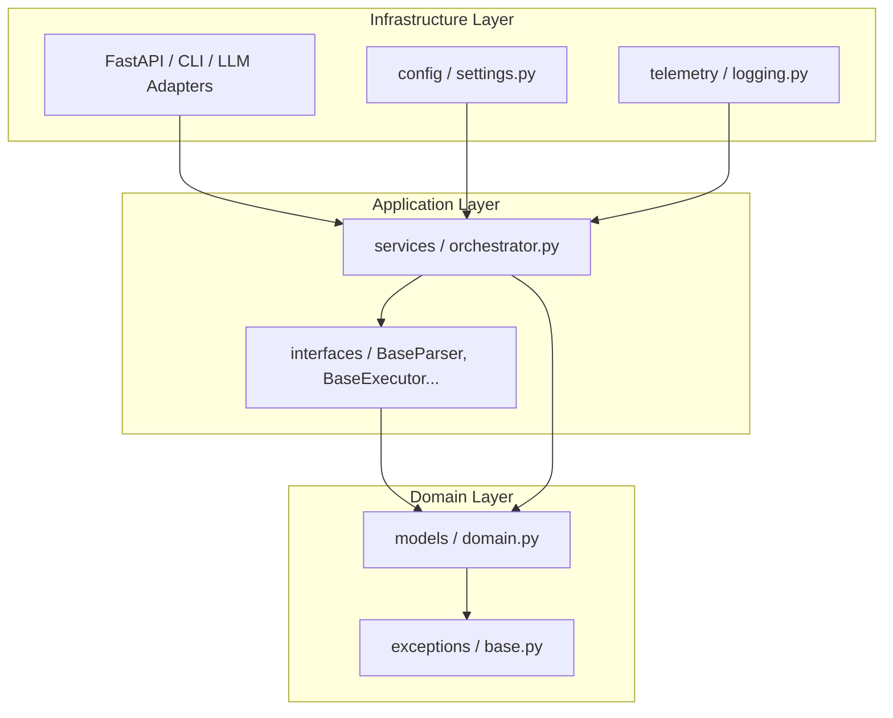
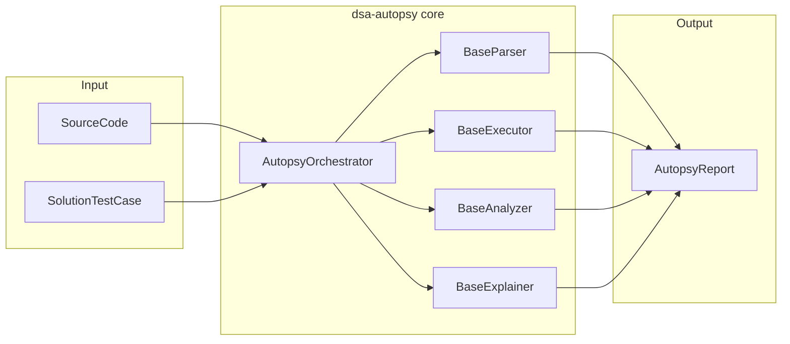
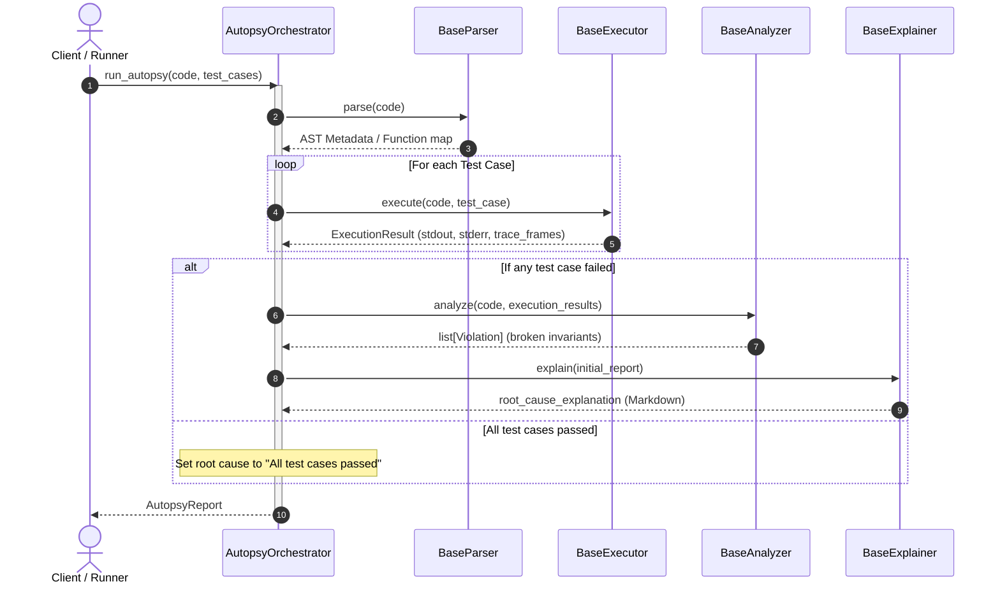

# DSA Autopsy Architecture & Extension Guide

This document describes the design principles, structural layers, and extensibility patterns of the `dsa-autopsy` AI-powered debugging engine.

---

## 1. Clean Architecture Boundaries

To ensure `dsa-autopsy` is modular, testable, and future-proof, we strictly enforce **Clean Architecture** boundaries. Dependencies flow inward:



### Domain Layer (`src/dsa_autopsy/models`, `exceptions`)
The core domain is free of external framework dependencies.
- **Models**: Defines raw dataclasses (`SourceCode`, `TestCase`, `TraceFrame`, `Invariant`, `Violation`, `AutopsyReport`).
- **Exceptions**: Defines semantic errors (`ParserError`, `ExecutionError`, `InvariantViolationError`).

### Application Layer (`src/dsa_autopsy/interfaces`, `services`)
Declares use cases and contracts:
- **Interfaces**: Defines abstract base classes (`BaseParser`, `BaseExecutor`, `BaseAnalyzer`, `BaseExplainer`) that enforce method contracts.
- **Orchestration**: The `AutopsyOrchestrator` implements the debugging workflow by calling these interfaces without depending on concrete implementation details.

### Infrastructure Layer (`src/dsa_autopsy/config`, `telemetry`)
Handles cross-cutting concerns:
- **Config**: Pydantic settings loading env variables/dotenv values.
- **Telemetry**: Structured JSON log formatting and file handlers.

---

## 2. Future Component Integrations (Extensibility)

The project bootstrap provides the exact abstractions needed to plug in new engines. Below are guides on how to implement them:

### A. Implementing a Tree-sitter Parser
To parse multiple languages using Tree-sitter, create a concrete parser class implementing `BaseParser`:

```python
# Location: src/dsa_autopsy/parsers/tree_sitter_parser.py
from tree_sitter import Parser, Language
from dsa_autopsy.interfaces.parser import BaseParser
from dsa_autopsy.models.domain import SourceCode
from dsa_autopsy.exceptions import ParserError

class TreeSitterParser(BaseParser):
    def __init__(self, languages: dict[str, str]) -> None:
        # Load compiled language grammar paths
        self.parser = Parser()

    def parse(self, code: SourceCode) -> dict[str, Any]:
        try:
            # Load tree-sitter language and parse
            tree = self.parser.parse(bytes(code.content, "utf8"))
            return {"root": tree.root_node}
        except Exception as e:
            raise ParserError(f"Tree-sitter failed: {e}") from e

    def extract_functions(self, code: SourceCode) -> list[str]:
        # Traverses tree and finds function definition nodes...
        pass
```

### B. Implementing an LLM Explainer
To use Anthropic or Gemini for generating root-cause failure explanations:

```python
# Location: src/dsa_autopsy/explainers/llm_explainer.py
import google.generativeai as genai
from dsa_autopsy.interfaces.explainer import BaseExplainer
from dsa_autopsy.models.domain import AutopsyReport
from dsa_autopsy.config import settings

class GeminiExplainer(BaseExplainer):
    def __init__(self) -> None:
        api_key = settings.AI_API_KEY.get_secret_value() if settings.AI_API_KEY else None
        genai.configure(api_key=api_key)
        self.model = genai.GenerativeModel(settings.AI_MODEL_NAME)

    def explain(self, report: AutopsyReport) -> str:
        prompt = self._build_prompt(report)
        response = self.model.generate_content(prompt)
        return response.text

    def _build_prompt(self, report: AutopsyReport) -> str:
        # Construct detailed debugging context for the LLM
        pass
```

### C. Exposing a FastAPI Web Server & gRPC Interface
To serve `dsa-autopsy` as a microservice in the **DSA Collective** ecosystem, create an adapter service layer:

```python
# Location: src/dsa_autopsy/adapters/api.py
from fastapi import FastAPI, Depends
from dsa_autopsy.models.domain import SourceCode, TestCase
from dsa_autopsy.services.orchestrator import AutopsyOrchestrator
# Import actual engines
from dsa_autopsy.parsers.tree_sitter_parser import TreeSitterParser
from dsa_autopsy.explainers.llm_explainer import GeminiExplainer

app = FastAPI()

def get_orchestrator() -> AutopsyOrchestrator:
    return AutopsyOrchestrator(
        parser=TreeSitterParser(),
        executor=SandboxedDockerExecutor(),
        analyzer=StaticTraceAnalyzer(),
        explainer=GeminiExplainer()
    )

@app.post("/autopsy")
async def run_debugging_session(
    code: SourceCode,
    test_cases: list[TestCase],
    orchestrator: AutopsyOrchestrator = Depends(get_orchestrator)
):
    report = orchestrator.run_autopsy(code, test_cases)
    return report
```

---

## 3. Dependency Injection Pattern

The dependency graph remains inverted because `AutopsyOrchestrator` receives interfaces, not concrete classes. During runtime, dependencies can be resolved manually or via dependency injection frameworks (e.g. `dependency_injector` or FastAPI's dependency system):

```python
# Wiring up production dependencies
parser = TreeSitterParser()
executor = DockerSandboxExecutor()
analyzer = InvariantChecker()
explainer = LLMExplainer()

orchestrator = AutopsyOrchestrator(
    parser=parser,
    executor=executor,
    analyzer=analyzer,
    explainer=explainer
)
```

---

## 4. Component Diagram

The component diagram outlines the boundary of the `dsa-autopsy` library, demonstrating how inputs map to the orchestrator, interfaces, and final reports:



---

## 5. Sequence Diagram (Workflow Lifecycle)

The following sequence diagram details the runtime lifecycle of a debugging autopsy execution:



---

## 6. Future Repository Integration

The `dsa-autopsy` engine is designed to run asynchronously and scale under heavy analysis workloads. When integrated into the wider **DSA Collective** ecosystem, external repositories will interact with the engine using two primary patterns:

### A. HTTP REST API / WebSockets (FastAPI)
For synchronous or near-real-time user interactions (e.g. requesting a solution autopsy from an IDE plugin or web page), a FastAPI web service can wrap the core library. WebSockets can be used to stream stdout, stderr, and incremental traces frame-by-frame.

### B. Message Queue / Worker Pool (Celery + RabbitMQ / Redis)
Since LLM generation and sandboxed Docker executions are I/O and CPU-bound, a worker-queue pattern is highly recommended for batch processing:
1. The submission platform publishes an `autopsy_request` event.
2. Celery workers pick up the task and invoke `AutopsyOrchestrator.run_autopsy(...)`.
3. The generated `AutopsyReport` is saved to a shared relational database or object store (S3), and a webhook notifies the requesting service.

